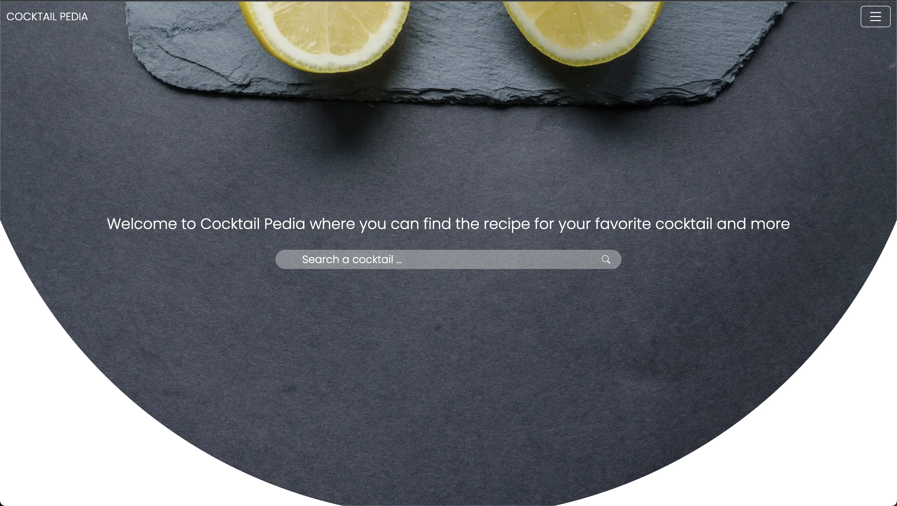
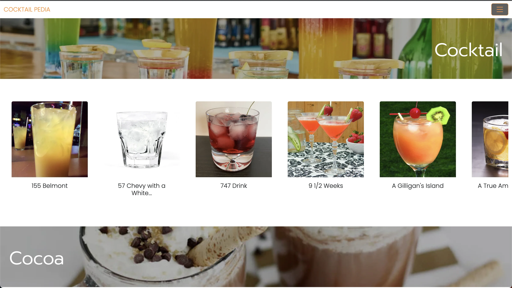
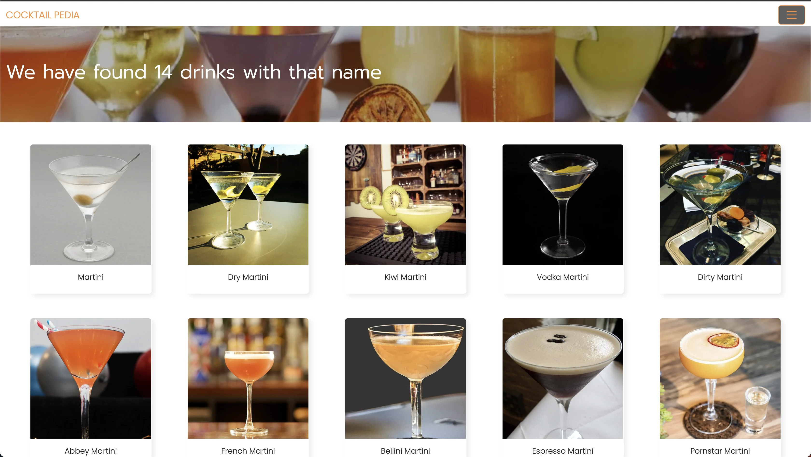
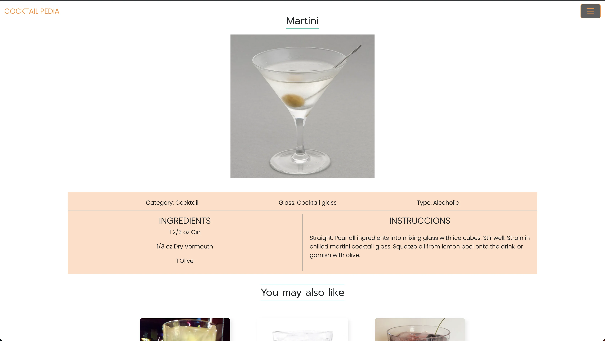

# Coctail Pedia

This is a cocktail information page where the user can see all the information about the cocktail such as: its ingredients and how to make it. The data used on this page comes from the cocktaildb API, which is a cocktail database. The purpose of this page is only educational for Escalab Bootcamp.









## Get started

The first thing to do is open the terminal of your code editor of your choice and once there you will have to make sure to enter the folder called "cocktail", to enter it you must write "cd cocktail".

```sh
   cd ..
   cd cocktail
```

Once the following command is executed, you should run the next one:

```sh
   npm run start
```

After completing these steps, now you will be able to use the page normally, for that you have to open your browser and write the following in the URL; http://localhost:3000/

## UI

Built with React js, react-dom, react-scripts, react-bootstrap-icons, axios, css

## API

https://www.thecocktaildb.com/api.php
